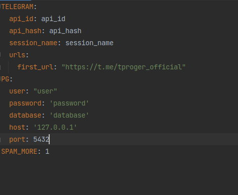

#                       Парсер для выявления не спамящих участников
___

# Предварительная установка и запуск

- ### Прежде все необходимо установить сам репозиторий с github
  ```git clone https://github.com/Mr-Dino/telegram_parser```
- ###  Переходим в консоли в репозиторий 
    ```cd telegram_parser```
- ### Устанавливаем зависимости 
  ```pip install -r requirements.txt```
- ### Переходим в директорию с кодом
  ```cd src```
- ### Запускаем локально наше приложение
  ```python app.py```

# Работа парсера
- ## Переходим в pgAdmin или в другое приложение содержимого базы

# Примеры данных в БД

### Таблица users
<table>
  <tr>
    <th>id</th>
    <th>first_name</th>
    <th>last_name</th>
    <th>phone</th>
    <th>user_id</th>
    <th>is_avatar</th>
    <th>region</th>
  </tr>
  <tr>
    <td>1</td>
    <td>Kirill</td>
    <td>Alexeev</td>
    <td>88005553535</td>
    <td>258112060</td>
    <td>false</td>
    <td>(NULL)</td>
  </tr>
  <tr>
    <td>2</td>
    <td>Я</td>
    <td>бобер</td>
    <td>(NULL)</td>
    <td>258112062</td>
    <td>false</td>
    <td>(NULL)</td>
  </tr>
</table>

- ## Файл конфигурации
> - Параметр SPAM - опциональный, он определеяет
> какое количество одинаковых сообщений нужно считать спамом
> - Параметры в TELEGRAM - стаднартные
- session_name - название файла сессии
для того, чтобы не было проблем сессию надо класть в папку src 
- api_hash - получаем из Telegram (по ссылке https://my.telegram.org/auth)
- api_id - получаем из Telegram (по ссылке https://my.telegram.org/auth)
- в urls лежат списки url телеграм каналов, которые надо парсить
> - В PG лежат стандартные параметры для подключения к БД Postgres
